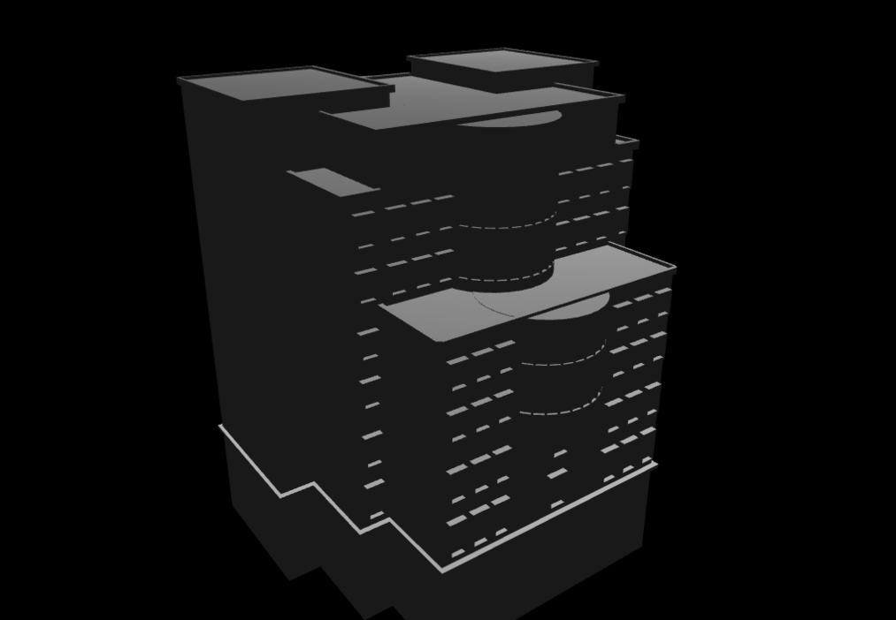

# ece-building
A virtual tour of Electrical &amp; Computer Engineering department of University of Tehran using OpenGL to implement an FPS-like camera and lighting and loading the model and  Blender for designing the model.

